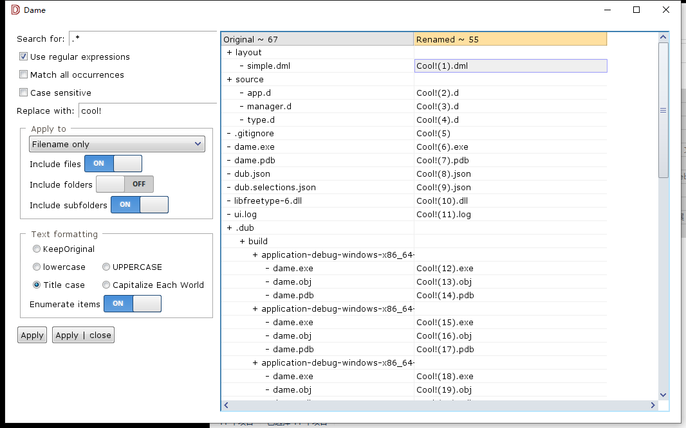

# Dame

A file batch naming tool inspired by PowerRename
## Screenshots




## Features

- Modify the file names of a large number of files, without giving all of the files the same name.
- Perform a search and replace on a targeted section of file names.
- Perform a regular expression rename on multiple files.
- Check expected rename results in a preview window before finalizing a bulk rename.

## Installation

Download source code from the release page, then

```bash
  cd Your Directory/dame
  dub run
```
    
## Roadmap

- File list filters
- Shortcut key support
- Pre-made pattern names (time date, etc.)
- More language support
- Tracked file order
- Resolve file conflict issues
## Acknowledgements

 - [PowerToys](https://github.com/microsoft/PowerToys)
 - [dlangui](https://github.com/buggins/dlangui)
 - [D Programming Language](https://github.com/dlang)


## License

[MIT](https://choosealicense.com/licenses/mit/)

